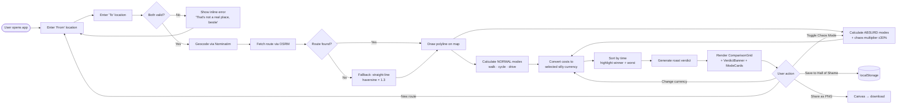

# GooberMaps 🎯


## Basic Details
### Team Name: Vortex


### Team Members
- Team Lead: [Ann Maria] - [SOE, CUSAT]
- Member 2: [Devika Rejith] - [SOE, CUSAT]

### Project Description
- GooberMaps is a fun map app that compares normal travel with ridiculous options like Spider-Man swinging, pogo-sticking, and unicycling. It calculates the time and absurdity of each route. It also helps us in covering the expenditure of each travel in more and more unhinged ways.


### The Problem (that doesn't exist)
- The nonexistent crisis of **not knowing whether Spider-Man swinging to your destination is faster than driving**.
- Humanity has spent millennia asking *"how do I get from A to B?"* and approximately zero minutes asking *"how many kidneys would that cost if I pogo-sticked there?"*
- Google Maps refuses to factor in **unicycle physics, zipline terminal velocity, or the emotional toll of roller skating uphill**.
- There is **no tool** that tells you your commute is 47 apples or 0.3 corneas.
- People are out here making real decisions with real data. **We fixed that.**

### The Solution (that nobody asked for)
**GooberMaps** is a map-based travel comparison app that answers the question no one asked: *"What if I did this ridiculous thing instead?"*

Enter a start and destination. We'll plot the route. Then we'll tell you how long it takes to **walk, cycle, or drive** — and right next to it, how long it takes to **swing like Spider-Man, wobble on a unicycle, bounce on a pogo stick, roller skate, or zipline straight over the city** (ignoring buildings, laws, and physics).

Every cost gets converted into **fictional currencies**: apples, oranges, rubber ducks, hours of minimum wage, grams of artisanal sourdough, or *body parts*.

A verdict banner at the top **roasts you based on your worst decision**. Because someone needs to.

---

## Technical Details

### Technologies/Components Used

**For Software:**
- **Languages:** TypeScript, HTML, CSS
- **Frameworks:** React 18, Vite
- **Libraries:** Leaflet, react-leaflet, Tailwind CSS, Zustand
- **APIs (all free, no keys):** OpenStreetMap tiles, Nominatim (geocoding), OSRM demo server (routing)
- **Tools:** Vercel (deployment), GitHub Actions (typecheck CI), shadcn/ui (component primitives)


---

### Implementation

**For Software:**

# Installation
```bash
git clone https://github.com/annmariatech/useless_project_temp.git
cd useless_project_temp
npm install
```

# Run
```bash
npm run dev
# Opens at http://localhost:5173
```

**Production build:**
```bash
npm run build
npm run preview
```

**Deploy to Vercel:**
```bash
vercel --prod
```

---

### Project Documentation

**For Software:**

# Screenshots (Add at least 3)

Landing page of GooberMaps showing the map at your location


Lets jump from here to cusat road by pogo sticks :p


Or maybe we'll walk to the Bahamas 


# Diagrams



## 🧠 How the Absurdity Works

| Mode | Speed | Cost Basis | Chaos Factor |
|---|---|---|---|
| 🚶 Walking | 5 km/h | Free | None |
| 🚲 Cycling | 15 km/h | ₹0.50/km | None |
| 🚗 Driving | 50 km/h | ₹12/km | None |
| 🕷️ Spider-Man Swing | 40 km/h | Free (web fluid) | ±30% |
| 🎪 Unicycle | 8 km/h | ₹2/km (dignity tax) | ±30% |
| 🦘 Pogo Stick | 4 km/h | ₹5/km (knee insurance) | ±30% |
| 🛼 Roller Skates | 12 km/h | ₹1/km | ±30% |
| 🪢 Zipline | 60 km/h | ₹200 flat (setup) | Straight-line only |

---

## 🛡️ Guardrails Against Reality

- **No paid APIs.** Nominatim is rate-limited to 1 req/sec with a descriptive `User-Agent`.
- **No backend.** Your questionable travel choices never leave your device.
- **localStorage only.** Past absurdities are stored in a "Hall of Shame" — clearable via a button labeled *"Clear my sins"*.
- **CI-enforced types.** A GitHub Action runs `tsc -b --noEmit` on every push so Vercel never sees a broken build again.

---

## 🏆 Why This Exists

Because someone had to ask: *"What if the commute was measured in organs?"*

And because a hackathon with no useful theme deserves a project with no useful output.

---

## 📜 License

MIT — do whatever, just don't actually zipline to work.

---

## 🙏 Acknowledgements

- OpenStreetMap contributors (the real heroes)
- Every unicyclist who has ever been asked "but why"
- You, for reading this far

## Team Contributions
- Ann Maria: Project ideation, typescript coding
- Devika Rejith: Handled UI/UX and project documentation 

---
Made with ❤️ at TinkerHub Useless Projects 
